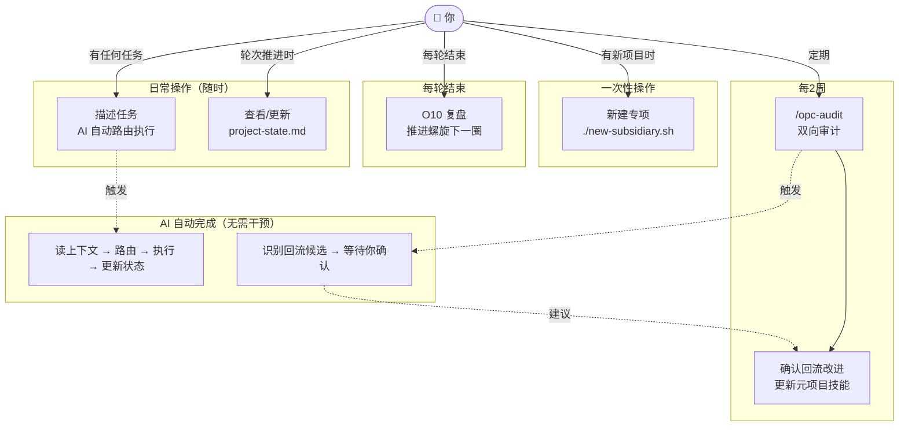
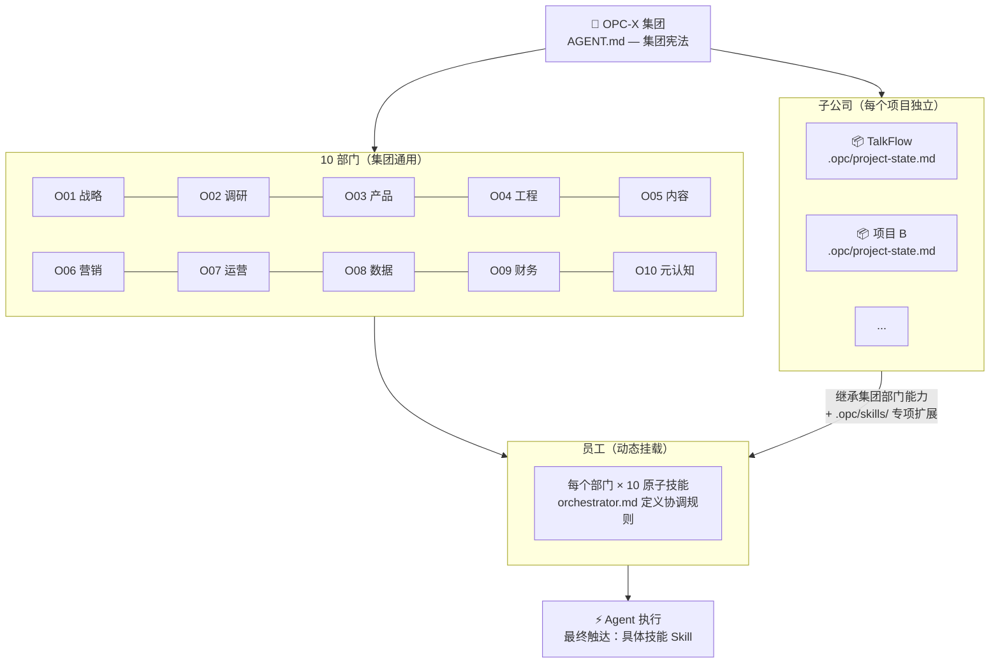
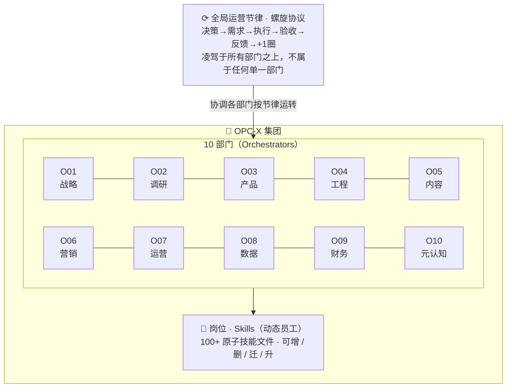
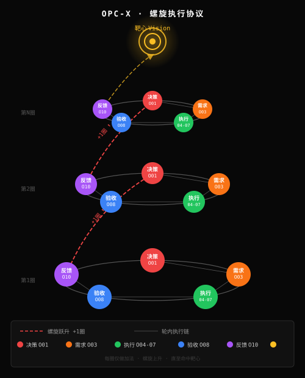
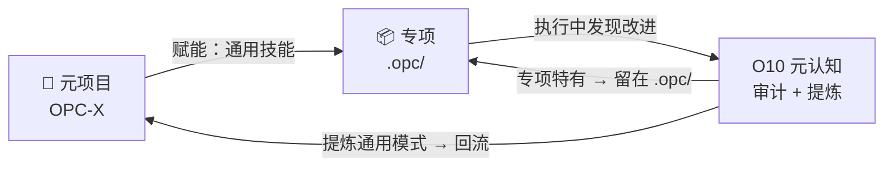
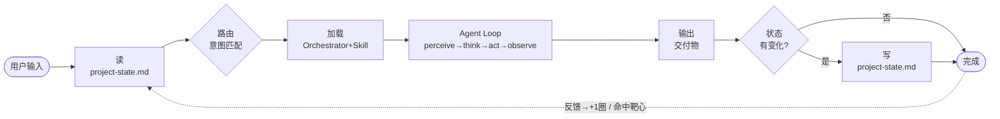

# OPC-X — One-Person Company eXoskeleton

**一键安装：**
```bash
curl -fsSL https://raw.githubusercontent.com/opc-x/opc-x/main/install.sh | bash
```

**新建项目：**
```bash
opc init talkflow              # 在当前目录初始化
opc init talkflow ~/projects/talkflow  # 指定路径
```

> 安装后把项目目录丢给任意 AI → 集团能力立即激活。

---

## 语义定义（消歧义，优先读）

OPC-X 同时承载两层语义，两种说法指向同一个东西：

| 维度 | OPC-X 本体 | 具体项目 |
|---|---|---|
| **组织维度** | 集团 | 子公司 |
| **项目维度** | 元项目 | 专项 |

**推理规则**：
- 问「能力从哪来 / 技能归谁所有」→ 用**组织维度**：集团提供，子公司继承
- 问「现在执行什么范围 / 读哪个上下文」→ 用**项目维度**：专项隔离，读 `.opc/`
- 两层语义**不冲突**，分别回答不同问题，可同时成立

**文件归属**：
```
元项目(集团) = opc-x/              → 通用能力，跨专项复用
专项(子公司) = {project}/.opc/     → 项目状态，专项隔离
```

### 名词对照（组织视角 ↔ 工程视角）

| 组织视角（人看） | 工程视角（Agent 执行） | 说明 |
|---|---|---|
| 集团 | OPC-X / AGENT.md | 整个系统，宪法文件 |
| 子公司 | 专项 / `.opc/` | 具体项目，状态独立 |
| 部门 | Orchestrator | 职能域，10个，结构静态 |
| 员工 / 岗位 | Skill | 原子执行单元，动态增删 |
| 运营节律 | 螺旋协议 | 全公司工作节奏，凌驾于部门之上 |
| 一轮工作 | 螺旋一圈 | 决策→需求→执行→验收→反馈 |
| 靶心 / 目标 | Vision | `project-state.md` 里的终极目标 |
| 项目进度 | `project-state.md` | 螺旋记忆，每轮任务前读、后写 |
| CEO 办公室 | O10 · 元认知 | 复盘 / 审计 / 系统迭代 |
| 招聘 | 新建技能文件 | 按需增加岗位能力 |
| 离职 | 删除技能文件 | 淘汰过时岗位 |
| 调岗 | 技能回流 | 专项技能 → 元项目，需人确认 |
| 升职 | Prompt 迭代优化 | 同岗位能力提升 |

---

## 用例图（你怎么用这套系统）



---

## 视角一：组织架构

> 回答「这个公司有什么、谁干什么」。方便人理解和调用。

### 全链路层级（集团 → 子公司 → 部门 → 员工 → 执行）



### 部门内层级



| 层 | 公司类比 | 实现 | 特性 |
|---|---|---|---|
| 运营节律 | 公司运作节奏 | 螺旋协议 | 全局，静态规则 |
| 部门 | 10 个职能域 | Orchestrators | 静态结构 |
| 员工 | 原子执行岗位 | Skills (.md) | **动态流动** |

**员工（Skills）流动规则**：

| 动作 | 操作 |
|---|---|
| 招聘 | 按需新建技能文件 |
| 离职 | 删除过时技能 |
| 调岗（回流） | 专项技能 → 元项目，需人确认 |
| 升职 | prompt 迭代优化 |

### 全局运营节律（螺旋协议）

> 公司级别的执行节奏，不是任何一个部门的功能。O10 元认知负责「反馈」这一步，让 +1圈 能发生，但螺旋本身属于全公司。



> 三环同构：决策(O01)→需求(O03)→执行(O04-07)→验收(O08)→反馈(O10)，每圈 +1 层，螺旋上升至靶心。

### 反哺协议（技能回流）



| 改进类型 | 判断标准 | 动作 |
|---|---|---|
| 通用模式 | 其他专项也能用 | 更新 `opc-x/orchestrators/` 对应技能 |
| 专项特有 | 只有这个领域用 | 留在 `.opc/skills/`，不回流 |

触发路径：专项执行 → `/opc-audit` 识别候选 → **你确认** → 更新元项目技能文件

---

## 视角二：工程执行

> 回答「Agent 怎么跑、状态怎么传、一次任务的完整流程」。方便人机协同。

### 单次任务执行契约



输出格式：
```
[O{NN}·{域} → S{NN}·{技能名}]
{交付物}
---
状态更新：{更新了什么 / 无}
💡 下一步：{推荐关联技能}
```

**微观层（agent-loop，所有 agent 内置，无需定义）**：
```
perceive → think → act → observe → loop
OPC-X 螺旋运行在它之上，不干涉它。
```

### 路由表

#### O01 · Strategy · 战略部
触发：目标 / OKR / 战略 / 规划 / 转型 / 竞争 / 商业模式 / 市场
`S01`目标设定 · `S02`优先级矩阵 · `S03`市场规模 · `S04`商业模式 · `S05`转型决策
`S06`风险评估 · `S07`资源分配 · `S08`OKR设计 · `S09`竞争定位 · `S10`扩张退出

#### O02 · Research · 调研部
触发：调研 / 竞品 / 用户洞察 / 趋势 / 问卷 / 数据来源
`S01`竞品分析 · `S02`用户访谈 · `S03`趋势扫描 · `S04`文献综述 · `S05`问卷设计
`S06`数据来源 · `S07`洞察合成 · `S08`用户画像 · `S09`JTBD分析 · `S10`行业标杆

#### O03 · Product · 产品部
触发：PRD / 需求 / 功能 / 路线图 / MVP / 用户故事 / 验收
`S01`PRD撰写 · `S02`功能范围 · `S03`路线图 · `S04`用户故事 · `S05`线框图规格
`S06`验收标准 · `S07`AB测试 · `S08`MVP定义 · `S09`Changelog · `S10`反馈分类

#### O04 · Engineering · 工程部
触发：代码 / 架构 / bug / 重构 / API / 安全 / 性能 / CI/CD
`S01`代码评审 · `S02`架构设计 · `S03`调试诊断 · `S04`重构规划 · `S05`API设计
`S06`测试策略 · `S07`性能审计 · `S08`安全审查 · `S09`DevOps配置 · `S10`技术债

#### O05 · Content · 内容部
触发：文章 / 文案 / 文档 / 社交 / 邮件 / 脚本 / SEO / newsletter
`S01`博客文章 · `S02`营销文案 · `S03`技术文档 · `S04`社交媒体 · `S05`邮件序列
`S06`视频脚本 · `S07`SEO优化 · `S08`标题测试 · `S09`案例研究 · `S10`订阅通讯

#### O06 · Marketing · 营销部
触发：营销 / 渠道 / 活动 / 增长 / 广告 / 发布 / 裂变 / 留存
`S01`渠道筛选 · `S02`活动策划 · `S03`落地页优化 · `S04`增长实验 · `S05`裂变设计
`S06`广告创意 · `S07`漏斗分析 · `S08`留存策略 · `S09`合作开发 · `S10`产品发布

#### O07 · Operations · 运营部
触发：SOP / 流程 / 工具 / 自动化 / 客服 / 日程 / 供应商
`S01`SOP撰写 · `S02`工具选型 · `S03`自动化设计 · `S04`工作流梳理 · `S05`供应商管理
`S06`客服流程 · `S07`用户引导 · `S08`日程规划 · `S09`会议协调 · `S10`故障响应

#### O08 · Data · 数据部
触发：数据 / 指标 / SQL / 分析 / 报告 / 埋点 / 看板
`S01`指标定义 · `S02`仪表盘设计 · `S03`SQL查询 · `S04`队列分析 · `S05`报告撰写
`S06`数据清洗 · `S07`数据可视化 · `S08`异常检测 · `S09`预测建模 · `S10`埋点设计

#### O09 · Finance · 财务部
触发：定价 / 收入 / 财务 / 现金流 / 合同 / 融资 / CAC / LTV
`S01`定价策略 · `S02`收入预测 · `S03`支出追踪 · `S04`发票生成 · `S05`税务规划
`S06`单位经济学 · `S07`现金流 · `S08`融资材料 · `S09`财务模型 · `S10`合同审查

#### O10 · Meta · 元认知
触发：复盘 / 学习 / 习惯 / 审计 / 决策 / 精力 / 系统迭代
`S01`周复盘 · `S02`技能差距 · `S03`学习计划 · `S04`系统审计 · `S05`习惯设计
`S06`知识沉淀 · `S07`精力管理 · `S08`决策日志 · `S09`失败分析 · `S10`愿景迭代

---

## 子公司接入协议

新项目运行：`./new-subsidiary.sh <项目名> <项目路径>`

生成结构：
```
project/
├── CLAUDE.md          ← @OPC-X/AGENT.md + @.opc/context.md
├── .opc/
│   ├── context.md        ← 该项目的领域知识
│   ├── project-state.md  ← 该项目的螺旋状态
│   └── skills/           ← 项目专项技能（覆盖/扩展集团技能）
```

---

*OPC-X v2.1 · 两视角分离 · 集团能力通用 · 子公司状态独立 · 终身复用。*
