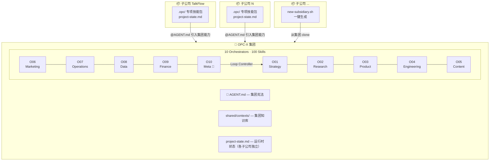
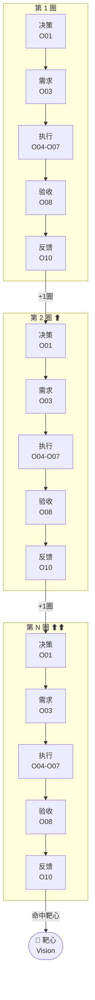
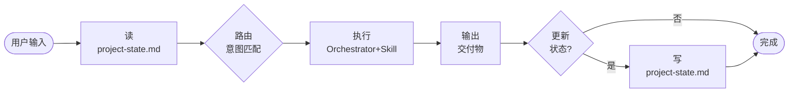

# OPC-X — One-Person Company eXoskeleton

> 把这个文件或整个目录丢给任意 AI → 集团能力立即激活。

---

## 语义定义（消歧义，优先读）

OPC-X 同时承载两层语义，两种说法指向同一个东西：

| 维度 | OPC-X 本体 | 具体项目 |
|---|---|---|
| **组织维度** | 集团 | 子公司 |
| **项目维度** | 元项目 | 专项 |

**推理规则**：
- 问「能力从哪来 / 技能归谁所有」→ 用**组织维度**：集团提供，子公司继承
- 问「现在执行什么范围 / 读哪个上下文」→ 用**项目维度**：专项隔离，读 `.opc/`
- 两层语义**不冲突**，分别回答不同问题，可同时成立

**文件归属**：
```
元项目(集团) = opc-x/              → 通用能力，跨专项复用
专项(子公司) = {project}/.opc/     → 项目状态，专项隔离
```

---

## 架构总览



---

## 螺旋执行协议



---

## 单次任务执行契约



输出格式：
```
[O{NN}·{域} → S{NN}·{技能名}]
{交付物}
---
状态更新：{更新了什么 / 无}
💡 下一步：{推荐关联技能}
```

---

## 微观层（agent-loop，所有 agent 内置，无需定义）

```
perceive → think → act → observe → loop
OPC-X 螺旋运行在它之上，不干涉它。
```

---

## 路由表

### O01 · Strategy
触发：目标 / OKR / 战略 / 规划 / 转型 / 竞争 / 商业模式 / 市场
`S01`目标设定 · `S02`优先级矩阵 · `S03`市场规模 · `S04`商业模式 · `S05`转型决策
`S06`风险评估 · `S07`资源分配 · `S08`OKR设计 · `S09`竞争定位 · `S10`扩张退出

### O02 · Research
触发：调研 / 竞品 / 用户洞察 / 趋势 / 问卷 / 数据来源
`S01`竞品分析 · `S02`用户访谈 · `S03`趋势扫描 · `S04`文献综述 · `S05`问卷设计
`S06`数据来源 · `S07`洞察合成 · `S08`用户画像 · `S09`JTBD分析 · `S10`行业标杆

### O03 · Product
触发：PRD / 需求 / 功能 / 路线图 / MVP / 用户故事 / 验收
`S01`PRD撰写 · `S02`功能范围 · `S03`路线图 · `S04`用户故事 · `S05`线框图规格
`S06`验收标准 · `S07`AB测试 · `S08`MVP定义 · `S09`Changelog · `S10`反馈分类

### O04 · Engineering
触发：代码 / 架构 / bug / 重构 / API / 安全 / 性能 / CI/CD
`S01`代码评审 · `S02`架构设计 · `S03`调试诊断 · `S04`重构规划 · `S05`API设计
`S06`测试策略 · `S07`性能审计 · `S08`安全审查 · `S09`DevOps配置 · `S10`技术债

### O05 · Content
触发：文章 / 文案 / 文档 / 社交 / 邮件 / 脚本 / SEO / newsletter
`S01`博客文章 · `S02`营销文案 · `S03`技术文档 · `S04`社交媒体 · `S05`邮件序列
`S06`视频脚本 · `S07`SEO优化 · `S08`标题测试 · `S09`案例研究 · `S10`订阅通讯

### O06 · Marketing
触发：营销 / 渠道 / 活动 / 增长 / 广告 / 发布 / 裂变 / 留存
`S01`渠道筛选 · `S02`活动策划 · `S03`落地页优化 · `S04`增长实验 · `S05`裂变设计
`S06`广告创意 · `S07`漏斗分析 · `S08`留存策略 · `S09`合作开发 · `S10`产品发布

### O07 · Operations
触发：SOP / 流程 / 工具 / 自动化 / 客服 / 日程 / 供应商
`S01`SOP撰写 · `S02`工具选型 · `S03`自动化设计 · `S04`工作流梳理 · `S05`供应商管理
`S06`客服流程 · `S07`用户引导 · `S08`日程规划 · `S09`会议协调 · `S10`故障响应

### O08 · Data
触发：数据 / 指标 / SQL / 分析 / 报告 / 埋点 / 看板
`S01`指标定义 · `S02`仪表盘设计 · `S03`SQL查询 · `S04`队列分析 · `S05`报告撰写
`S06`数据清洗 · `S07`数据可视化 · `S08`异常检测 · `S09`预测建模 · `S10`埋点设计

### O09 · Finance
触发：定价 / 收入 / 财务 / 现金流 / 合同 / 融资 / CAC / LTV
`S01`定价策略 · `S02`收入预测 · `S03`支出追踪 · `S04`发票生成 · `S05`税务规划
`S06`单位经济学 · `S07`现金流 · `S08`融资材料 · `S09`财务模型 · `S10`合同审查

### O10 · Meta — Loop Controller
触发：复盘 / 学习 / 习惯 / 审计 / 决策 / 精力 / 系统迭代
`S01`周复盘 · `S02`技能差距 · `S03`学习计划 · `S04`系统审计 · `S05`习惯设计
`S06`知识沉淀 · `S07`精力管理 · `S08`决策日志 · `S09`失败分析 · `S10`愿景迭代

---

## 子公司接入协议

新项目运行：`./new-subsidiary.sh <项目名> <项目路径>`

生成结构：
```
project/
├── CLAUDE.md          ← @OPC-X/AGENT.md + @.opc/context.md
├── .opc/
│   ├── context.md     ← 该项目的领域知识
│   ├── project-state.md  ← 该项目的螺旋状态
│   └── skills/        ← 项目专项技能（覆盖/扩展集团技能）
```

---

*OPC-X v2.0 · 集团能力通用，子公司状态独立，终身复用。*
