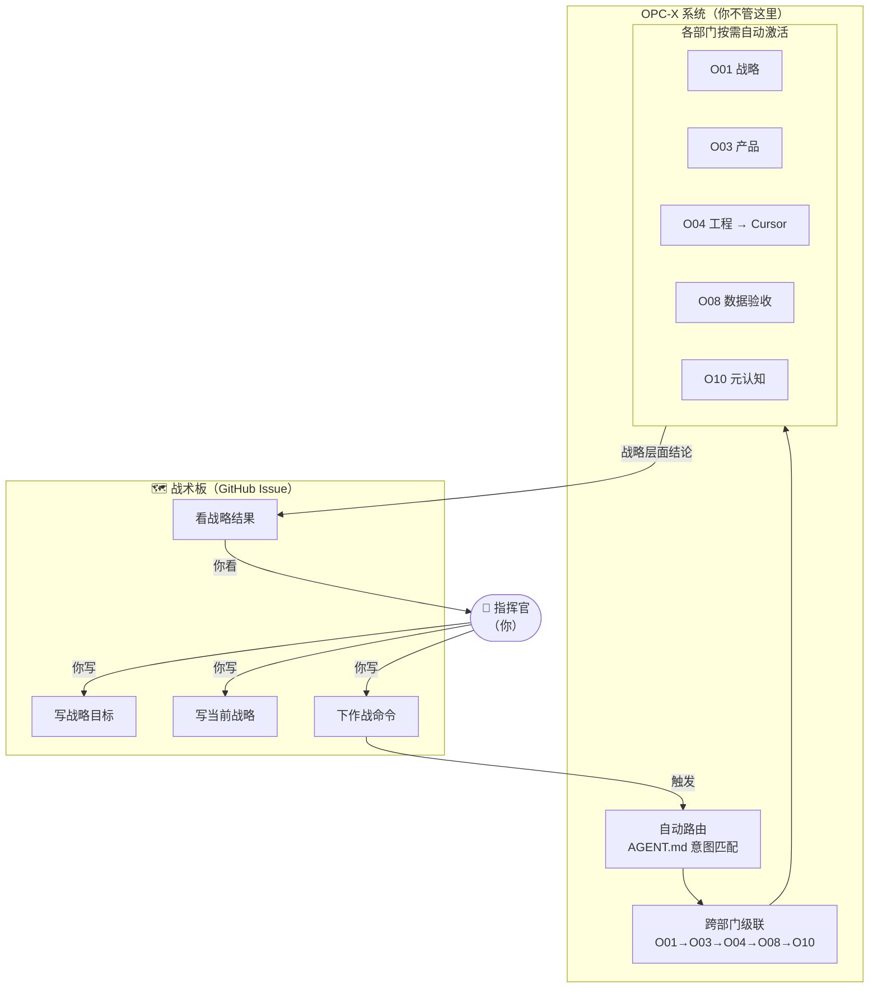

# {PROJECT} 战术板 · 第N圈

## 战术板用例图

---

## 战略目标

{终极靶心——你定，轻易不改}

---

## 当前战略

{本圈一句话——你定，每圈开始时写}

---

## 作战命令

| # | 命令 | 状态 |
|---|------|------|

状态：`待执行` · `执行中` · `完成` · `挂起`

---

## 战略结果

| 命令# | 战略成果 | 关键验证数据 |
|-------|---------|------------|
